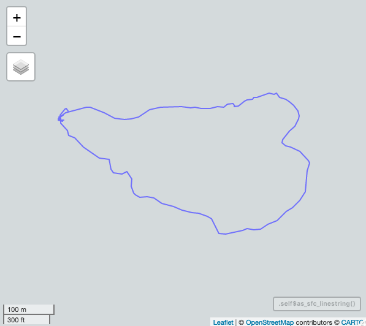
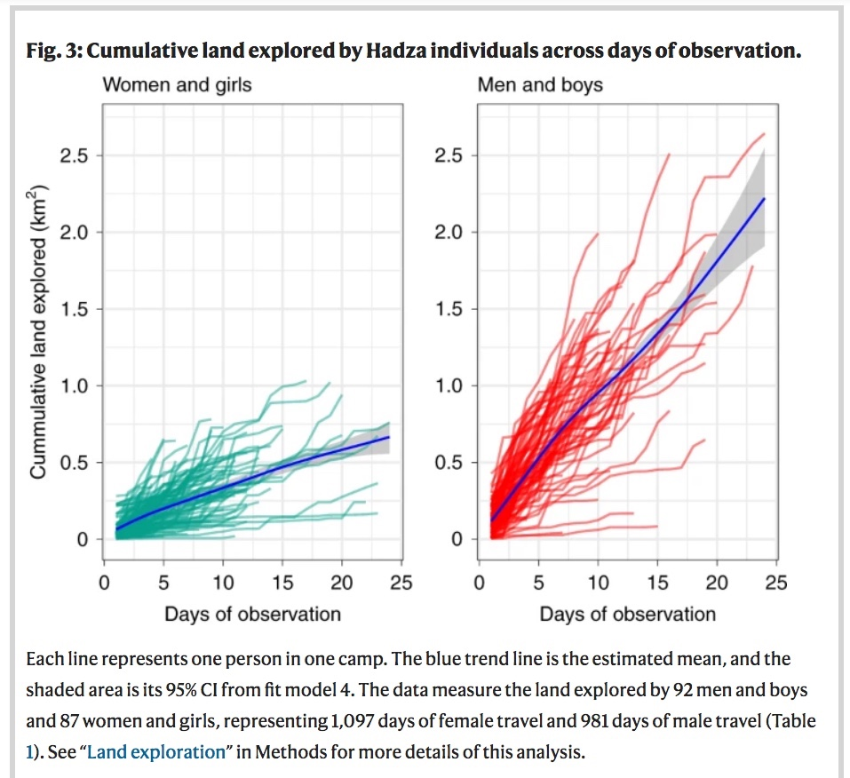
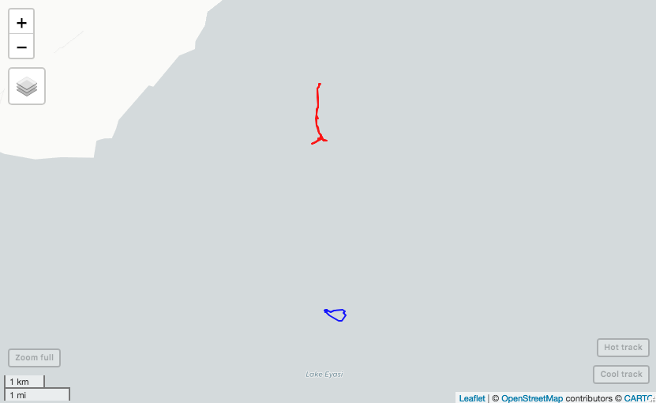

```{r, include = FALSE}
knitr::opts_chunk$set(
  collapse = TRUE,
  comment = "#>"
)
```

<b>xtracks</b> provides tools for the visualization and analysis of spatiotemporal data describing human movement patterns (real or simulated).  This tool is built with social scientists and ecologists studying human movement using GPS data in mind. xtracks is in active development and new measures of individual and collective movement and social interaction will be  added over time. This version (1.0) produces measures including daily distances traveled, sinuosity of travel paths, raster measures of landscape use, and rates of habitat exploration. This vignette explains these functions. A word of caution: xtracks imports several other R packages for geospatial analysis including 'sp', 'sf', 'raster', 'mapview', 'geosphere', and 'maptools'. This is a hefty set of packages, and the first time you install this package you will no doubt be prompted to install or update several of these dependencies. 

## Installing xtracks

```{r, eval=FALSE}
#run this next line if you don't have devtools installed
install.packages("devtools")
devtools::install_github("brianwood1/xtracks")
```

## Load xtracks package

```{r, eval=TRUE}
library(xtracks)
```

## Load spatiotemporal data

Raw data taken from GPS devices takes many forms. I will leave the initial processing stage to you, blessed geospatial analyst. After you pluck, skin, and disinfect that raw data, you may import it into xtracks in the following form: 

```{r, load_data, echo=TRUE}
head(d1)
```

As you can see, the data you feed into xtracks includes run-of-the-mill GPS data (lat, lon, elevation, time stamp, elevation) but also include a 'distance from camp' measure and 'in camp' binary variable. These later values are also your responsibility to construct, using criteria that are relevant to your study. They happen to be critical for functions xtracks uses. The meaning of these values will be explained more in a bit. 

## Construct an xtracks object

To construct an xtrack object, one must specify:

- lat
- lon
- elevation
- in-camp status
- time
- distance from camp centroid
- whether each trackpoint is "in camp" or not
- the utm_epsg code. 

lat and lon are expected to be in decimal-degree, WGS 84 format, which is the default in most GPS devices. elevation is expected to be in meters above sea level. The "in_camp" parameter refers to whether each trackpoint is within or outside the boundaries of a residential area, which in Wood et al. (2021) referred to the spatial boundaries of a Hadza camp; but could more generally be considered the boundaries of a residential or habitation area, something like a village or a camp, as appropriate in a given field setting. This is useful for segmenting travel for the purposes of acquiring resources -- AKA foraging travel, and needed for sinuosity measures. Distance from camp centroid is expected to be the as-the-crow-flies distance from the center of a residential area / 'camp' in meters (also needed for sinuosity measures). The epsg code identifies the UTM zone of your study location. This is needed for projecting lat / lon coordinates into UTM space. To find the epsg code for your study location region of your track, check out https://spatialreference.org/ref/epsg/

Assuming these initial data are in place, the code to construct an xtrack object is as follows:

```{r, construct_xtracks}

xt_1 <- xtrack(lat=d1$lat, lon=d1$lon, elevation_m=d1$elevation_m, in_camp=d1$in_camp, unix_time=d1$unix_time, distance_from_camp_m=d1$distance_from_camp_m, utm_epsg=32736)
xt_2 <- xtrack(lat=d2$lat, lon=d2$lon, elevation_m=d2$elevation_m, in_camp=d2$in_camp, unix_time=d2$unix_time, distance_from_camp_m=d2$distance_from_camp_m, utm_epsg=32736)
```

## View the xtrack

A nice interactive map of the xtrack can be created using mapview. More visualization options will be highlighted at the end of the vignette.

```{r, eval=FALSE, echo=TRUE}
xt_2$as_mapview()
```


```{r, echo=FALSE}

```

## Analysis Functions

### Get the total length of the xtrack in kilometers

```{r}
xt_1$track_length_km
```

### Get the total duration of the xtrack in hours

```{r}
xt_1$track_duration_hr
```

### Segmentation of travel into bout of out of camp travel

Here I demonstrate segmentation of travel into *bouts* of out of camp travel. An out of camp bout is when an individual leaves camp, travels some distance, and then returns to camp.

```{r, eval=TRUE, echo=TRUE}
out_of_camp_bout_records_1 <- xt_1$get_out_of_camp_bout_records()
out_of_camp_bout_records_2 <- xt_2$get_out_of_camp_bout_records()
head(out_of_camp_bout_records_1)
```

### Get the trackpoints of the longest duration bout

```{r}
trackpoints_of_longest_duration_bout <- xt_1$get_longest_bout_trackpoints()
head(trackpoints_of_longest_duration_bout)
```

### Test if the xtrack has data sufficient to enable sinuosity calculations of the manner carried out in Wood et al. (2021)

```{r}
xt_1$has_data_for_sinuosity_measures()
xt_2$has_data_for_sinuosity_measures()
```

### Get inbound and outbound sinuosity following the methods of Wood et al. (2021)
```{r}
xt_2$get_inbound_sinuosity()
xt_2$get_outbound_sinuosity()
```

### Get more sinuosity-related measures

How to get more measures related to inbound and outbound sinuosity. These include:
- The length (km) of the outbound and inbound segments as traveled,
- The length (km) of the 'as the crow flies' distance from the point of leaving camp to the most distant point (sp_distance_outbound_km).
- The length of the 'as the crow flies' distance from the most distant point to the point of returning to camp (sp_distance_inbound_km).
- The mean sinuosity of the inbound and outbound segments,
- The trackpoint_id of the most distant (from camp centroid) trackpoint.

```{r}
xt_2$get_sinuosity_measures()
```

### Raster analysis identifying all places visited on the landscape.

This produces a binary raster representation of the xtrack, where cells that are visited are given value 1, and those not visited given value 0. The length and width of the raster cells in meters is determined by the parameter <code>cell_size_m</code> and is by default 10. This function also accepts a parameter called <code>selected_trackpoints</code> which determines which of the trackpoints are rasterized. The acceptable values are 'all', 'in_camp', or 'out_of_camp'. The default is 'all', as used in Wood et al. (2021).

```{r}
bin_ras_1_10m <- xt_1$as_raster_of_habitat_visited_binary()
bin_ras_1_20m <- xt_1$as_raster_of_habitat_visited_binary(cell_size_m=20)
par(mfrow=c(1,2))
raster::plot(bin_ras_1_10m, main="10 meter cells", legend=FALSE)
raster::plot(bin_ras_1_20m, main="20 meter cells", legend=FALSE)
```

### Raster analysis measuring visitation intensity / occupation counts of places on the landscape

This produces a raster representation of the xtrack, where the count for each cell represents the number of trackpoints that fell within that cell's boundaries. Assuming that trackpoints are logged at regular time intervals, this measures the amount of time spent within each cell. Pretty cool! Un-visited cells are given value 0. As with the binary raster representation, The length and width of the raster cells in meters is determined by the parameter <code>cell_size_m</code> and is by default 10.


### Laws of human nature / extremely skewed distributions of occupation counts 

Law of human nature # 342: People are very choosy about where they go; 
Law of human nature # 716: People like to hang out in just a few places. 

Because of these iron-clad laws, occupation counts tend to be very sparse across the landscape and occupation counts form *extremely* right-skewed distributions. Visualizing these distributions is challenging; a helpful approach can be to take the logarithm of visitation counts, which compresses the variability into a range that can be more comfortably viewed.

```{r}
bin_ras_2 <- xt_1$as_raster_of_habitat_visited_counts()
raster::plot(bin_ras_2)
log_scale_bin_ras_2 <- log(bin_ras_2)
par(mfrow=c(2,2))
hist(raster::values(bin_ras_2), main="Occupation Count")
hist(raster::values(log_scale_bin_ras_2), main="Log-Occupation Count")
raster::plot(bin_ras_2, main="Occupation Count")
raster::plot(log_scale_bin_ras_2, main="Log Occupation Count")
```

### Analysis of rates of habitat exploration

Following Wood et al. (2021), this analysis computes the habitat visited / explored
each day, the marginal 'new' habitat visited for each day, and the cumulative habitat explored across all days. In a research application modeled on our paper, this analysis should be done with a temporally-sorted list of xtracks, with each xtrack representing one day of travel of the same person. In the list, the first day of data should be in position 1. For demonstration purposes, I construct below some dummy data that does not actually represent 8 days of real travel, but instead, segments 1 day into 8 partially overlapping (temporally and spatially) segments. Imagine however that 'xt_3' through 'xt_10' represent 8 days of travel; the code works the same.

#### Construct the example data

```{r}
d_temp <- d1
d3 <- d_temp[1:1000,]
d4 <- d_temp[500:2000,]
d5 <- d_temp[1500:3000,]
d6 <- d_temp[2500:4000,]
d7 <- d_temp[3500:5000,]
d8 <- d_temp[4500:6000,]
d9 <- d_temp[5500:7000,]
d10 <- d_temp[6500:8260,]

xt_3 <- xtrack(lat=d3$lat, lon=d3$lon, elevation_m=d3$elevation_m, in_camp=d3$in_camp, unix_time=d3$unix_time, distance_from_camp_m=d3$distance_from_camp_m, utm_epsg=32736)
xt_4 <- xtrack(lat=d4$lat, lon=d4$lon, elevation_m=d4$elevation_m, in_camp=d4$in_camp, unix_time=d4$unix_time, distance_from_camp_m=d4$distance_from_camp_m, utm_epsg=32736)
xt_5 <- xtrack(lat=d5$lat, lon=d5$lon, elevation_m=d5$elevation_m, in_camp=d5$in_camp, unix_time=d5$unix_time, distance_from_camp_m=d5$distance_from_camp_m, utm_epsg=32736)
xt_6 <- xtrack(lat=d6$lat, lon=d6$lon, elevation_m=d6$elevation_m, in_camp=d6$in_camp, unix_time=d6$unix_time, distance_from_camp_m=d6$distance_from_camp_m, utm_epsg=32736)
xt_7 <- xtrack(lat=d7$lat, lon=d7$lon, elevation_m=d7$elevation_m, in_camp=d7$in_camp, unix_time=d7$unix_time, distance_from_camp_m=d7$distance_from_camp_m, utm_epsg=32736)
xt_8 <- xtrack(lat=d8$lat, lon=d8$lon, elevation_m=d8$elevation_m, in_camp=d8$in_camp, unix_time=d8$unix_time, distance_from_camp_m=d8$distance_from_camp_m, utm_epsg=32736)
xt_9 <- xtrack(lat=d9$lat, lon=d9$lon, elevation_m=d9$elevation_m, in_camp=d9$in_camp, unix_time=d9$unix_time, distance_from_camp_m=d9$distance_from_camp_m, utm_epsg=32736)
xt_10 <- xtrack(lat=d10$lat, lon=d10$lon, elevation_m=d10$elevation_m, in_camp=d10$in_camp, unix_time=d10$unix_time, distance_from_camp_m=d10$distance_from_camp_m, utm_epsg=32736)
```

#### Create a list of xtracks

```{r}
list_of_xtracks <- list(xt_3, xt_4, xt_5, xt_6, xt_7, xt_8, xt_9, xt_10)
```

#### Execute the habitat exploration analysis

```{r}
hab_exp_results <- get_hab_exp_across_days(list_of_xtracks, cell_size_m = 10)
```

Results of this analysis are handed back in a hopefully easy to understand data frame format.

```{r}
hab_exp_results
```

#### Plot the results of habitat exploration analysis

Here is figure 3 in Wood et al. 2021

```{r, echo=FALSE}

```

The plot below is modeled on that figure, though not as fancy. What is plotted is just one individual's travel across simulated days. The y-axis here is also in units of square meters, not square kilometers. The goal here is demonstrate the computing tools; turning this bare-bones plot into something nicer will be your design challenge :).

```{r}
plot(x=hab_exp_results$day, y=hab_exp_results$cum_sum_square_meters_visited_across_days, type="l", xlab="Day", ylab="Cummulative land explored (meters squared)", main="Habitat Explored Across Days")
```

## Data Export from xtracks to other formats

### dataframe

It is easy to get all the trackpoints from an xtrack into dataframe format. Note that this representation has more more information and annotations that the 'raw' data used to construct an xtrack. This includes columns for the time between each trackpoint, meters traveled between trackpoints, speed of travel between trackpoints, and the utm coordinates of each trackpoint.

```{r}
trackpoints_1 <- xt_1$get_trackpoints()
head(trackpoints_1)
```

### KML

KML files are used in Google Earth and elsewhere.

```{r}
xt_1$write_kml_file(kml_file_name = "xt_1_c.kml")
```

### GPX

```{r}
xt_1$write_gpx_file(gpx_file_name="xt_1.gpx", gpx_track_name="XT1")
```

### SpatialLinesDataFrame

This is an object type in the <code>sp</code> package, an important R package for spatial analysis

```{r}
xt_1_sldf <- xt_1$as_spatial_lines_dataframe()
class(xt_1_sldf)
```

## Plotting options

### Nice map

A call to <code>plot_nice_map_of_track<code> creates a 'nice map'
that harnesses ggplot2 functions. It is a clean plot of the xtrack's travel path with
a simple ggplot2 black and white theme, a customized scale bar, and some metadata displayed in the subtitle area. This function accepts parameters for a title (the_title), and the color of the line representing the xtrack (line_color).

```{r}
xt_1$plot_nice_map_of_track(the_title="Day 250", line_color="blue")
```

### Sinuosity map

A call to <code>plot_sinuosity_map</code> creates a visual representation of the outbound travel segment (red), the inbound segment (blue), travel in camp or during shorter out of camp segments (green),
the 'as the crow flies' shortest path segments used to calculate sinuosity measures (grey dashed line).
The trackpoint that is maximally distant from the camp centroid is plotted in yellow.
The sinuosity measures themselves are plotted in the subtitle and the plot accepts a parameter for the map title.

```{r}
xt_2$plot_sinuosity_map(the_title="Sinuosity map, Day 1324")
```

### Mapview map

A call to <code>as_mapview</code> is a thin interface to the package mapview, producing an interactive plot that can be viewed in the plot window or view in shiny applications. There is a known issue that makes it impossible currently to render a mapview map in an R markdown document, user beware. What are shown here are what you would see appearing in a plot window if you ran this code in an R-script; not what you would see if you ran this code in an R markdown document.

This function accepts all parameters that can be fed to the function mapview in the package mapview, such as layer.name, color, etc.

```{r, eval=FALSE}
xt_1$as_mapview(format="line", layer.name="Hot track", color="red")
```


Using the power of mapview, we can also display multiple xtracks on a dynamic map background
as follows:

```{r, eval=FALSE}
a <- xt_1$as_mapview(format="line", layer.name="Cool track", color="blue")
b <- xt_2$as_mapview(format="line", layer.name="Hot track", color="red")
a+b
```

```{r, echo=FALSE}

```

Other plotting options you can chose from might harness the power of 'plot' functions defined in other packages.
Below are simple examples of using the plot functions defined for
<code>sp</code> and <code>raster</code>; these plots can be sweetened by consulting those packages' documentation.

A plot of the spatialLinesDataFrame representation of the xtrack

```{r}
plot(xt_1$as_spatial_lines_dataframe())
```

A plot of the binary raster representation of the xtrack

```{r}
plot(xt_1$as_raster_of_habitat_visited_binary())
```

A plot of the integer count raster representation of the xtrack

```{r}
plot(xt_1$as_raster_of_habitat_visited_counts())
```

### Referenes

[to add]


